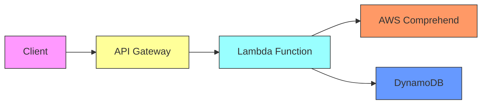

# 🚀 AWS Sentiment Analysis with Terraform & GitHub Actions

## 📝 Project Overview
This project automates the deployment of an **AWS-based Sentiment Analysis API** using **Terraform** for infrastructure and **GitHub Actions** for CI/CD. It leverages:
- **AWS Lambda** (Python-based sentiment analysis)
- **Amazon API Gateway** (To expose the API)
- **Amazon DynamoDB** (To store sentiment results)
- **Terraform** (Infrastructure as Code)
- **GitHub Actions** (Automated CI/CD)

## 📌 Features
✅ **Fully Serverless Architecture**  
✅ **Infrastructure as Code (Terraform)**  
✅ **Automated CI/CD using GitHub Actions**  
✅ **Secure Deployment with AWS IAM & GitHub Secrets**  
✅ **Easily Extendable for Custom NLP Models**  

## 🛠 Tech Stack

✅ Terraform – Infrastructure as Code (IaC)
✅ AWS Lambda (Python) – Serverless compute
✅ Amazon Comprehend – AI-powered sentiment analysis
✅ API Gateway – Expose Lambda as a REST API
✅ DynamoDB – Store sentiment analysis results
✅ IAM – Permissions for Lambda and API Gateway
✅ GitHub Actions – CI/CD for automation

## 📁 Project Structure

📂 sentiment-analysis-project
 ├── 📂 terraform
 │   ├── main.tf
 │   ├── variables.tf
 │   ├── outputs.tf
 │   ├── lambda.tf
 │   ├── api_gateway.tf
 │   ├── dynamodb.tf
 │   ├── iam.tf
 ├── 📂 lambda_function
 │   ├── lambda_function.py
 │   ├── requirements.txt
 ├── deploy.sh
 ├── README.md

## 📁 Project Architecture


---

## 🚀 Deployment Process (Automated)
### **1️⃣ Clone This Repository**
```sh
git clone https://github.com/YOUR_GITHUB_USERNAME/aws-sentiment-analysis.git
cd aws-sentiment-analysis
```

